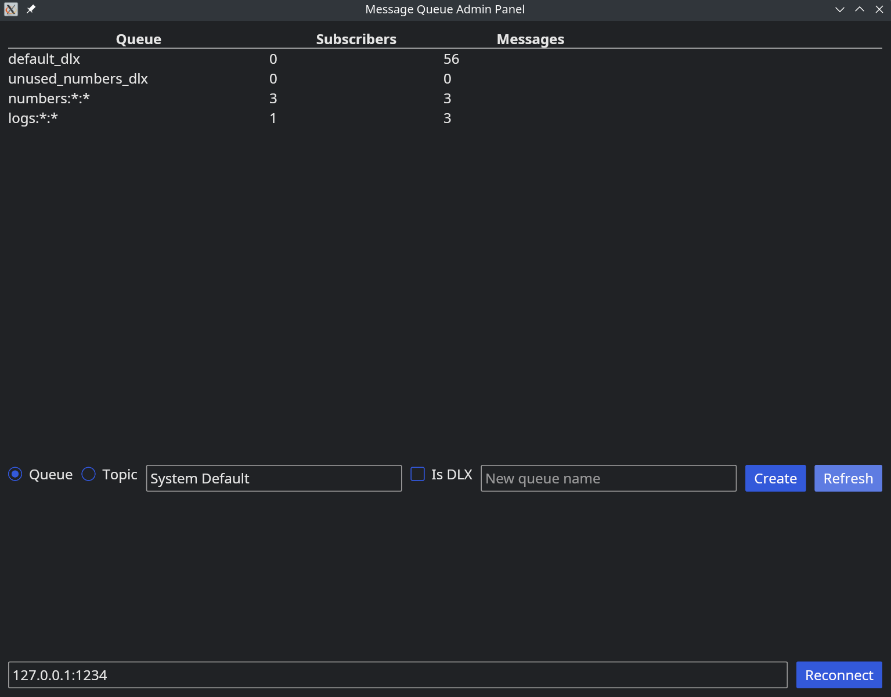
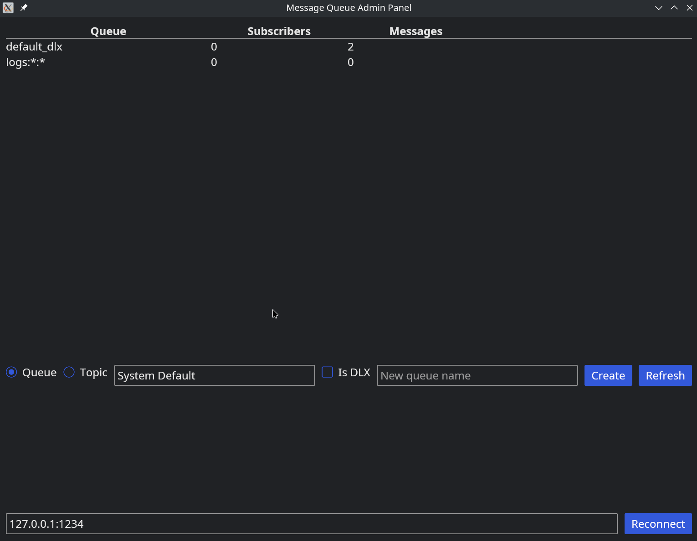
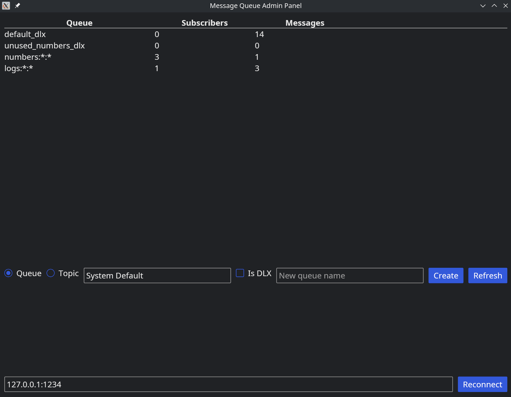
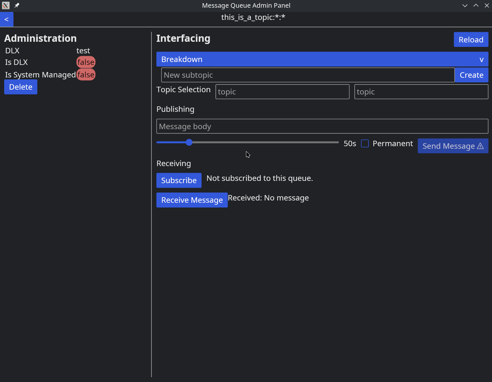
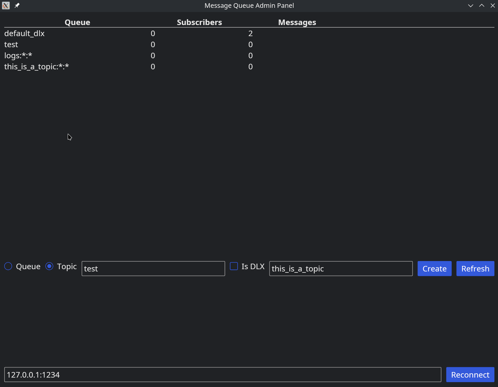
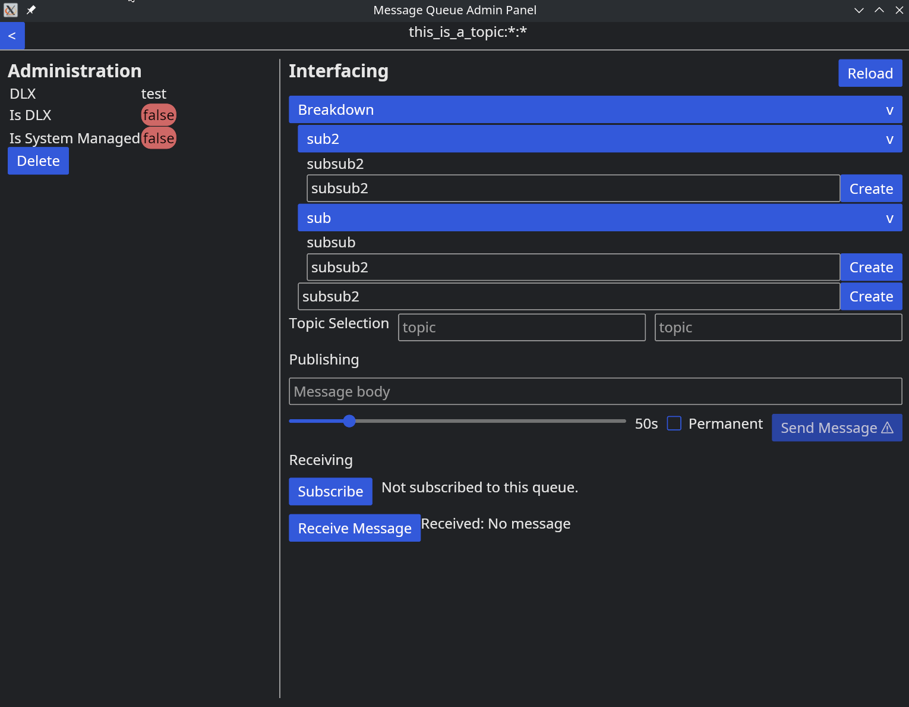
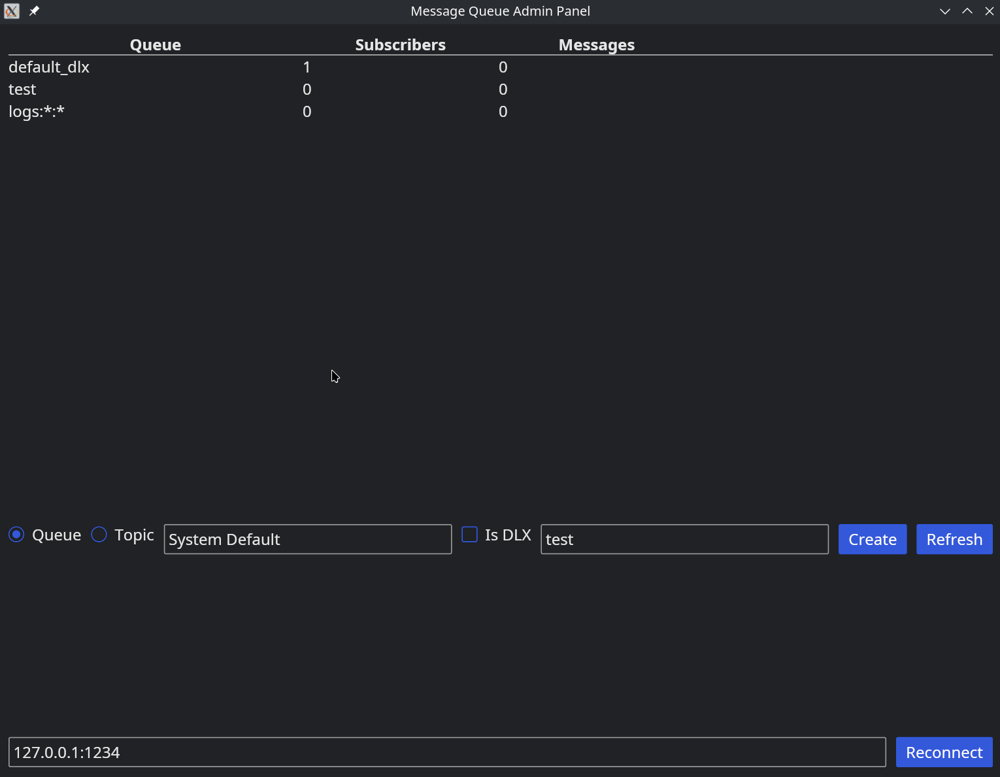

# Type-Safe Message Queue

## Summary

This project is a type-safe message queue implementation. Message queues are a middleware used to
facilitate (many-to-many) communication between applications without requiring these
applications to know
about the
others. This project implements this middleware with some commonly expected features. Other
message queues, like RabbitMQ or Apache Kafka (if we ignore some semantic differences), offer
scalable, resilient, and performant solutions. This project aims to mimic their use case whilst
applying some changes that are expected from Rust-based applications.

## Learning Objectives
### Tech Stack
- Rust
- Tokio
- Iced for GUI
- Serde + Postcard

### Concepts
- Asynchronous programming
- Multithreading & Concurrency
- Lifetimes
- Networking (TCP & Sockets)
- Rust Workspaces
- Rust Libraries

## Benefits
This implementation strongly benefits from compile-time checks to avoid several common runtime
mistakes. For example, a strongly-typed routing key avoids ill-formatted addresses for routing 
messages, only requiring an existence check. Another example is the API being available through
providing a known list of structs, for example:
```rust
pub struct CreateQueue {
    pub queue_address: NewQueueId,
    pub properties: UserQueueProperties,
}

impl Request for CreateQueue {
    type Response = Status;
}
```
This means that the server does not need to parse the request and its body, it only decodes the 
request. On the client side, the response type is known at compile time. One asterisk is that 
encode and decode errors, as well as other common request errors, need to be handled. For the 
above example, sending a request `CreateQueue` therefore yields the response 
`Result<<CreateQueue as Request>::Response, RequestError>`. 

These design choices allow API changes to be reflected in both the server and client 
implementations at compile time. However, this does mean that backwards compatibility between 
versions is not guaranteed, as any small tweak may drastically change the binary encoding, 
yielding decode errors on both sides when API versions are mismatched.

## Features

### Direct Queues

Direct queues are a many-to-many FIFO queue implementation. Any amount of publishers can push
messages to it, which are received by a single recipient. This implementation distributes
messages on a first-come-first-served basis. They are addressed by a single identifier and
messages cannot be filtered.

### Topics

Topics are more complex than direct queues. Topics can be hierarchically subdivided; in this
implementation up to 3 levels (implementation is designed to support any depth with minor tweaks)
. A message can be pushed to any topic or subtopic, and a subscriber can filter (sub)topics by
using wildcard notation. Additionally, topics broadcast message to their subscribers. This means 
that 
any subscriber whose filter matches the destination in the message's routing key will receive a 
copy of the message. Due to the nature of topics, messages can not easily buffered. As such, if 
there is no recipient for a message, it is dead-lettered (see DLX below).

### Administration Panel
To inspect and manage server state, I wanted to implement a graphical application that can 
visualise and command it using the server's API. This is the admin panel, residing in the 
`admin` workspace. Below are a few screenshots displaying the handful of screens available. 
These are made using a demo application in the `client` workspace.

Once booted, a user is greeted by the home screen. This gives an overview of the direct queues 
and topics currently available.

We can create new direct queues and topics, choose their default DLX and mark them as designated 
DLX. Although a DLX choice for a queue does not have to be a designated DLX, a designated DLX 
will ensure that messages are destructed if the expire whilst in that queue. 

We can then inspect a queue to see more information about it, as well as send and receive 
messages or subdivide topics.


Sending and receiving messages is different on direct queues and topics. For a topic, a concrete 
subtopic must be chosen, but for subscription, a range (or filter) can be selected.



### Typed Routing Keys
Routing keys are a message attribute that determines to which queue a message should be sent. 
Moreover, it also sets the dead-letter-exchange, more on that below. One problem with 
common message queue implementations, is that routing keys are strings that expect a specific 
format. The downside is that this is usually only parsed and validated on the server side. This 
causes a lot of unnecessary overhead. This implementation has all possible routing keys 
expressed in a `RoutingKey` type, which is part of a message's contents. The `Router` reads it 
and in some circumstances, modifies it. There is no parsing or validation (invalid addresses 
lead to dead-lettering, which is also defined).

```rust
pub enum DLXPreference {
    Default,
    Queue,
    Override(QueueId),
    Drop,
}

pub struct RoutingKey {
    pub id: QueueId,
    pub dlx: DLXPreference,
}

pub struct Message {
    pub payload: MessagePayload,
    pub routing_key: RoutingKey,
    pub ttl: TTL,
}
```

### Dead Letter Exchanges (DLX)
Production scale applications usually keep one or more dead letter exchanges (DLXs). A DLX is 
where a message goes if
- Its destination in the routing key does not exist;
- It expired because it exceeded its time to live (TTL);
- It is sent to a topic and there are no recipients.
In short, any message that is not or can not be received is sent to a DLX. This can be used for 
monitoring or error handling. This server only implements DLXs as direct queues, and creates 
one default DLX for the entire server. A queue (direct or topic) can also override the DLX for 
messages that it contains. On top of that, a message can optionally choose its own DLX.
```rust
pub enum DLXPreference {
    Default,
    Queue,
    Override(QueueId),
    Drop,
}
```
To demonstrate this, we can set the TTL of a message to 0 seconds.

A caveat to mention is that 
messages are only dead lettered if they are attempted to be received whilst at the front of the 
queue. In the video above, you see that I first subscribe to the queue and press "Receive" once. 
When this happens, it attempts to receive a valid message and the server dead-letters all others.
The default DLX then buffers this message until I retrieve it. This implementation could be 
improved by having a monitoring daemon periodically scan queues for expired messages.

### Logs as topics
In rust, logging is usually done using built-in log macros such as `info!`, `warn!`, and `error!
`. Any logging implementation can then be initialised without needing to adapt the rest of the 
source. The server utilises this to write logs to itself on a dedicated `logs` topic. This means 
that a monitoring app can subscribe to it and filter logs based on severity level out of the box.

## Feature To-Do List

- [ ] Disconnect senders and receivers when queue is deleted.
- [ ] Persist queues and queue configuration.
- [ ] Support other stream types over `StreamIO`.
- [ ] Add customisation.
    - [x] TTL.
    - [ ] Max capacity.
- [x] Dead lettering.
- [x] Send messages in queue to DLX on deletion.
- [x] Reconnect on disconnect admin panel.
- [x] Filtering on topics on the receiving end, i.e. creating topics and subtopics.
- [x] Messages with payloads other than strings (JSON, YAML, XML, etc.).
- [x] Logs are (also) messages onto a topic.
- [ ] Blocking receive requests.

## Redacted ideas

### Internal microservices

Some internal "services" of the server, the queue store and subscription manager, are shared
between a relatively large amount of other components, and hence locked behind an `Arc<Mutex<_>>`.
This creates ugly and hard to read code. A possible solution is to separate them into their own (
`tokio`) threads/processes and reach them using asynchronous calls. This mimics a microservice
architecture. Although this is a good idea in theory, it creates a lot of overhead through system
calls. On the other hand, expanding the system to a larger one consisting out of several
independently managed services would be more intuitive after such a change.