# Simple Raytracer

## Introduction

During my education, I took a course on computer graphics, learning about (among others)
rendering scenes using raytracing. We implemented a simple raytracer during that course, in C++.
As such, I thought it a nice task to refresh my knowledge on raytracers whilst learning rust.
Contrary to my course, I aimed to implement my linear algebra framework from scratch. This to
teach me about using generics, traits, and data management. With those aims in mind, I started
the project.

## Skills practiced

- Data management
- Borrow checker rules
- Pattern matching and destructuring
- Generics
- Trait bounds
- External crates/libraries
- Basic file handling

## Tech stack

- rust
- serde + serde_json

## Progress

### Phase 1: rending of spheres

My initial goal was to get basic rending of a view frustrum working. By hard coding all
necessary objects, I created a scene with basic hit detection of a sphere. Next, I aimed to
shade the sphere by computing the normal vectors. With that working, and iterating the code
several times to account for oversights and bugs, I added a secondary sphere into the scene.
After fixing problems with object intersection, I also implemented colouring of objects.

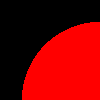
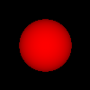
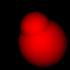
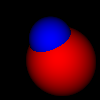

### Phase 2: generic vector structs

Up to this point, I had only needed vectors of type `f64` and magnitude 3. As such, I created a
simple `Vector3` class that contained the 3 values and all my necessary computations. Hardly a
scalable and reusable framework. Before continuing into more math-heavy topics, I wanted to
generalise my `Vector3` into a `Vector<T, N>`. Although this proved more challenging than my
prior knowledge suggested, ended up with a vector struct that could handle any type of member of
any length.

I was positively surprised that I could use _any_ type at all, even non-numerical ones. Although
trait bounds would limit their use as actual vectors, I discovered the beauty of how rust
handles this. Would I implement certain traits for a given non-numerical type, I found that I
could suddenly, for example, compute the cross-product of that type (regardless of how much
sense this would make). If I didn't already, I've grown to really appreciate the beauty,
flexibility, and surprising simplicity of rust's type and generics system.

### Phase 3: multiple object types

Next, I wanted to implement a slightly more complex secondary object into the scene. A cube
seemed like a reasonable next step. I went through the same hoops as with the sphere: getting
basic rendering working, then positioning, followed by rotation, as I could not yet rotate
either the cube or the camera. This is obviously required to see if all side of the cube render
as expected. I rendered all sides with the colour of their normal vector and checked the sides
by moving and rotating the camera using my new implementation.

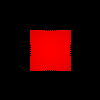
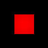
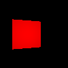
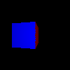
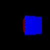

### Phase 4: file handling

Up to and until now, I had hardcoded my scenes into the `main.rs` file. This is an obvious no-go
when it comes to reusable programming. Hence, I wanted to add another component to my project:
(de)serialisation. I did this using the popular `serde` library with the `serde_json` extension
to store my scenes in JSON files. Although this is quite simple for most of the data in the
scene, it gets complex when loading a list of (at this point) cubes and spheres, in whatever
combination and of any size. Fortunately, I could remedy this by writing a custom deserialiser for
a `Box<dyn Object>`, and make `serde` handle the rest. Finally, I was able to render any scene
without needing to recompile my sources.

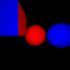

### Phase 5: Lighting

Next, I returned to doing more fundamental parts of raytracing: implementing a lighting model. The
obvious choice for a lighting model is the Phong model. I won't bore you with the details. To
get this to work, I had to overhaul my main tracing implementation. I added a `Light` trait, and
updated the `Scene` to contain a `Vec<box<dyn Light>>` in preparation of supporting several
light types. I then implemented diffuse lighting and a simple `PointLight` implementation to
work with. After that, the specular component was added, as well as a `Sun` implementation,
which acts as an infinite-distance light from a given direction. I wanted to store the Phong
constants as material properties for each object. That way, I could make all objects have their
own characteristics. I created a `Material` class that contains all such constants, as well as
the colour. In the future, this can support things like reflection types and textures without
needing modifications to the main raytracer.

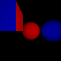
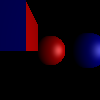
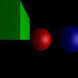
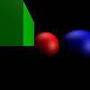

### Phase 6: Reflection

To continue with the tracer implementation, it is high time to implement light transport logic.
This means reflections and shadows. Both of these involve casting a ray from the hit point,
in the direction of a light or the reflection. Implementing this is relatively straightforward,
requiring minimal changes to the main tracer, which are, fundamentally, only generalisations of
the existing implementation.

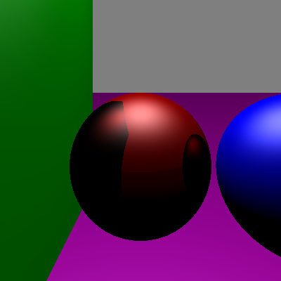
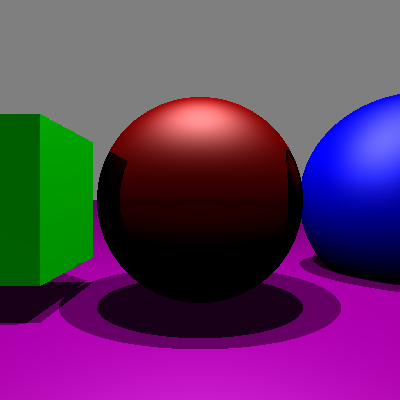

### Phase 7: Refraction

Using Snell's law, we can implement partially transparent objects and have light bend naturally.
To implement this, we extend the tracer once more by casting a secondary ray on transparent objects.
We give each object a index of refraction to compute the light-bending effect described by Snell's
law. Currently, this model does not support total internal reflection. We do check for this
phenomenon, and stop the recursive tracing once we encounter it.

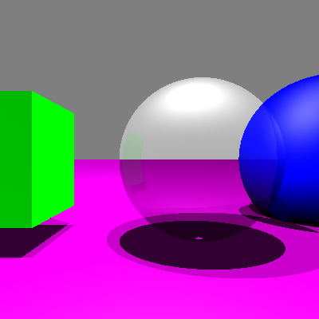
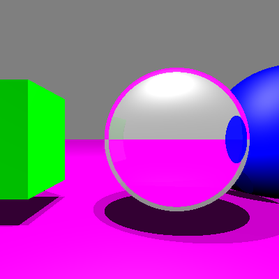

